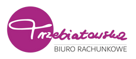

# 🏢 Biuro Rachunkowe Trzebiatowska – Nowy Serwis WWW

Nowoczesny, responsywny i zoptymalizowany pod konwersję serwis internetowy dla **Biura Rachunkowego Katarzyny Trzebiatowskiej** (Gdańsk Przymorze).



## 📌 Najważniejsze Cechy Projektu
* **11 w pełni zakodowanych podstron** (Strona Główna, O biurze, Certyfikaty, Księgowość JDG, Pełna Księgowość Spółki, Kadry i Płace, KSeF, Rejestracja firmy za 0 zł, Jak pracujemy, Opinie, Kontakt).
* **Oficjalne logo i dopasowana paleta barw:** Główny akcent `#a82682` (fuksjowa purpura / śliwka wyciągnięta z sygnetu logo).
* **Interaktywny kalkulator szybkiej wyceny** (`main.js`) z dynamiczną kalkulacją kosztów dla JDG, spółek i kadr.
* **Akcent na KSeF (Krajowy System e-Faktur)** oraz cyfrowy obieg faktur bez wożenia papierów.
* **Lokalne SEO Gdańsk Przymorze:** Ujednolicony adres (ul. Piastowska 89), metatagi oraz dane strukturalne Schema.org (`AccountingService` w JSON-LD).
* **Pełna dokumentacja i materiały handlowe** w pliku [`DOKUMENTACJA_I_HISTORIA_ROZMOWY.md`](DOKUMENTACJA_I_HISTORIA_ROZMOWY.md).

## 🚀 Jak uruchomić projekt lokalnie?
Projekt nie wymaga żadnych instalacji ani kompilacji. Działa od razu po pobraniu:

### Opcja 1: Bezpośrednio w przeglądarce
Kliknij dwukrotnie w plik `index.html`.

### Opcja 2: Lokalny serwer (opcjonalnie)
```bash
# Python:
python -m http.server 8080

# lub Node.js:
npx serve
```
Otwórz w przeglądarce adres `http://localhost:8080`.

## 📁 Struktura Plików
```
biuro-trzebiatowska/
├── index.html                  # Strona Główna (Hub & Kalkulator)
├── o-biurze.html               # Biografia p. Katarzyny, misja i relacje
├── certyfikaty.html            # Licencja MF 28310, ubezpieczenie Lloyd's, Orły Rachunkowości
├── ksiegowosc-jdg.html         # Ryczałt, KPiR, B2B, zmiana biura
├── pelna-ksiegowosc-spolki.html# Księgi handlowe, e-KRS, CIT, sprawozdania
├── kadry-i-place.html          # Akta osobowe, listy płac, ZUS, PIT-11
├── ksef.html                   # 4 kroki wdrożenia KSeF w firmie
├── rejestracja-firmy.html      # Zakładanie firmy za 0 zł (CEIDG / S24)
├── jak-pracujemy.html          # Cyfrowy obieg faktur i standardy pracy
├── opinie.html                 # Autentyczne referencje i oceny Google
├── kontakt.html                # Dojazd, mapa Google, formularz, NIP
├── DOKUMENTACJA_I_HISTORIA_ROZMOWY.md # Pełny raport, brief, wycena i mail do klientki
├── assets/
│   ├── css/
│   │   └── style.css           # Dodatkowe style i animacje
│   ├── js/
│   │   └── main.js             # Menu mobilne, kalkulator wyceny, FAQ, formularze
│   └── img/
│       ├── logo-default.png    # Oficjalne logo biura
│       ├── logo-transp.png     # Logo transparentne
│       └── favicon.png         # Sygnet z literą "T"
```

---
© 2026 Biuro Rachunkowe Trzebiatowska. Projekt przygotowany przez Mchabov.
